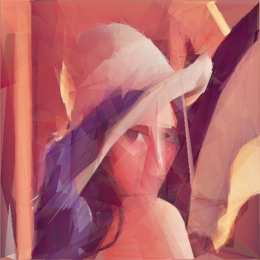

# Triangles

This code approximates an image using only triangles. All work is done on the GPU using OpenGL drawing and compute shaders.

It works by drawing a fixed amount of random triangles (100 by default) and comparing them to the reference image via Mean Square Error. On each iteration we randomly mutate a single value from the triangle array and re-evaluate the error again. If it decreases we keep the change, otherwise we revert it. By brute forcing this at GPU speeds, we can get visible results pretty quickly.

This is the C++ version, ported from the original [Rust version](https://github.com/wolfiestyle/triangles).

```
Approximates an image with random triangles
Usage: ./triangles/triangles [OPTIONS] image

Positionals:
  image TEXT:FILE REQUIRED    Input image file

Options:
  -h,--help                   Print this help message and exit
  -t,--tex-size UINT          Texture size used in computations
  -n,--num-tris UINT          Number of triangles in approximation
  -d,--draw-interval UINT     Display the result after N iterations
```

## Example output

```
image: img/Lenna.png
texture size: 512
num triangles: 300
drawing every 1000 iters
average color: [0.50554484, 0.17099285, 0.16232914, 1.0]
1504572 iters in 411.069255484s (4252 iters/s) error: 0.010000365         
saving image to img/Lenna_triangles.png
```

 Original                  | Triangles
:-------------------------:|:--------------------------------------:
 | 
